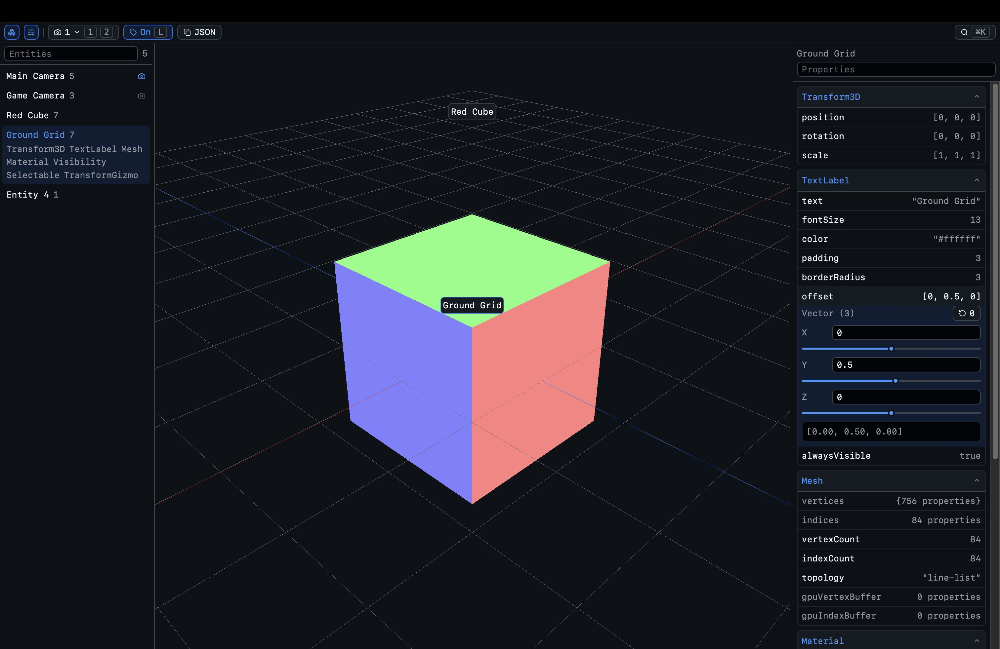

# Cascade Engine

A WebGPU 3D engine with a live ECS inspector.

The viewport is on one side, the entity list and property editor on the other. Pick something, move it, change a camera, tweak a number. The scene is just data sitting on entities; systems walk that data every frame.



[Live demo](https://cascade-engine.vercel.app)

## Run it

You’ll need pnpm and a browser that speaks WebGPU — Chrome or Edge is the path of least resistance.

```bash
pnpm install
pnpm dev
```

Then open [http://localhost:5173](http://localhost:5173). `pnpm build` / `pnpm preview` if you want a production build.

## Using it

Drag to orbit, scroll to zoom. Click in the viewport or the entity list to select. Selected things get a transform gizmo.

| Key | What it does |
| --- | --- |
| `N` | Toggle the entity list |
| `T` | Toggle the properties panel |
| `L` | Toggle floating labels |
| `1` / `2` | Switch cameras |
| `⌘K` / `Ctrl+K` | Command palette |

Editable properties show up at full brightness. Right-click an entity to select it, copy its id, or make it the active camera.

## Where things live

- `src/ecs` — entities, components, systems
- `src/gpu` — WebGPU device setup
- `src/components` — inspector, toolbar, editors
- `docs/styleguide.md` — how we write code here
